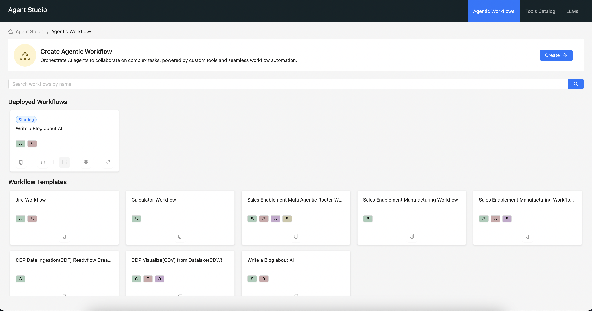
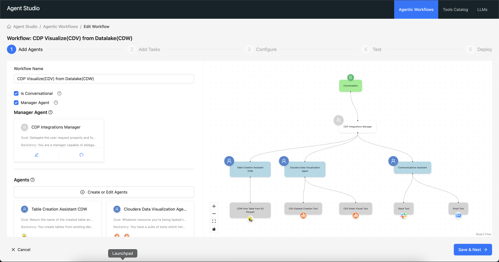
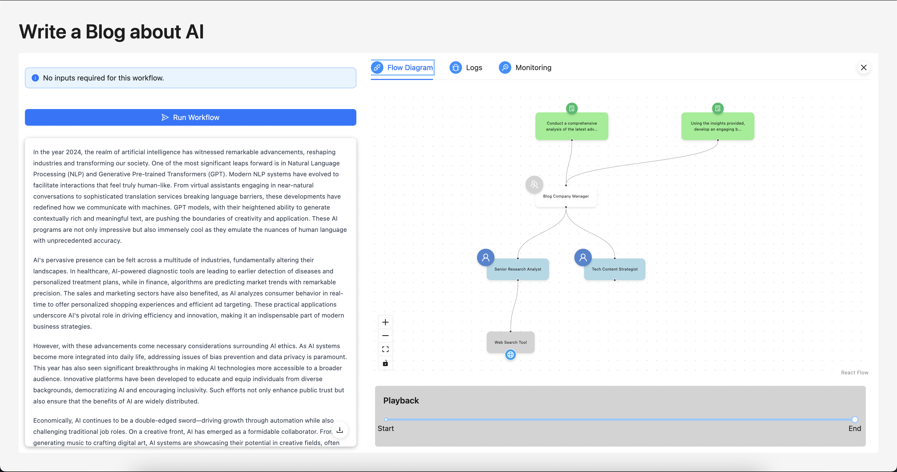

# Cloudera AI Agent Studio - Workflows

## Overview

Workflows are the core of AI agents. A workflow represents a collaborative group of agents working together to achieve a set of tasks. Each workflow defines the strategy for task execution and agent collaboration.

## Components of a Workflow

### Agents

Each agent can be standalone, or can have a arsenal of tools. From [CrewAI's docs](https://docs.crewai.com/concepts/agents), an agent is defined as an autonomous unit that can:
 - Perform specific tasks
 - Make decisions based on its role and goal
 - Use tools to accomplish objectives
 - Communicate and collaborate with other agents
 - Maintain memory of interactions
 - Delegate tasks when allowed

You can configure an agent with the following parameters:
 - **Role**: Defines the agent’s function and expertise within the workflow.
 - **Goal**: The individual objective that guides the agent’s decision-making.
 - **Backstory**: Provides context and personality to the agent, enriching interactions.
 - **Tools**: The tools that the agent can use to accomplish its goal.

### Tasks
A task is a unit of work that an agent can perform. Tasks provide all necessary details for execution, such as a description, the agent responsible, required tools, and more, facilitating a wide range of action complexities.

Tasks can be executed in two ways:
 - **Sequential**: Tasks are executed in the order they are defined
 - **Hierarchical**: Tasks are assigned to agents based on their roles and expertise

A task can be configured with the following parameters:
 - **Description**: A clear, concise statement of what the task entails.
 - **Expected Output**: A detailed description of what the task’s completion looks like.

## Creating a New Workflow

 1. You would be asked to pick a workflow name. For the sake of this example, we'll assume that you're creating a fresh workflow and not from a template.
 2. You're presented with two checkboxes:
    - **Is Conversational**: If checked, the workflow will be a conversational workflow.
    - **Manager Agent**: If checked, the workflow will have a manager agent. Having a manager agent allows the workflow to delegate tasks to suitable agents. Seleting this checkbox would change the workflow type from `sequential` to `hierarchical`.
 3. You can add agents to the workflow. For each agent, you can create a tool from existing tool template, or just a brand new tool.
 4. You can add tasks to the workflow. For each task, you will need to select the agent that should execute the task, if a manager agent is not selcted in the previous step.
 5. In the next step, you'll asked to conifgure the tools created in the previous step.
 6. Once tools are configured, you can test the workflow in-studio by providing inputs as defined in your tasks.
    - The tool configuration parameters(which might contain sensitive information like API keys) are stored securely in your browser's local storage.
 7. Once you're happy with the workflow, you can deploy it as a separate application in the workbench.
    - While deploying you can save the workflow as a [template](./workflows.md#workflow-templates) for future use.

**NOTE**: At any point in time during the above steps, you can drop from the workflow editor, and the workflow would be saved savely as a draft.

## Workflow Deployments
A deployed workflow is a stanadlone application that no longer allows you to edit the workflow. It is meant to be a production-ready application, ready to be used by end-users(or other stakeholders within your organization).

Each deployed consists of 2 components:
 - The workflow backend is served my a [AI Workbench model](https://docs.cloudera.com/machine-learning/cloud/models/topics/ml-models.html).
 - The workflow frontend is served by a [AI Workbench application](https://docs.cloudera.com/machine-learning/cloud/applications/topics/ml-applications-c.html).

A workflow when deployed, would give you deeplinks to access the application, the workbench configuration of the model & workbench configuration of the application.

## Workflow Templates
Workflow templates are pre-configured workflows that can be used as a starting point for new workflows. They are useful for quickly creating new workflows with a predefined structure.
